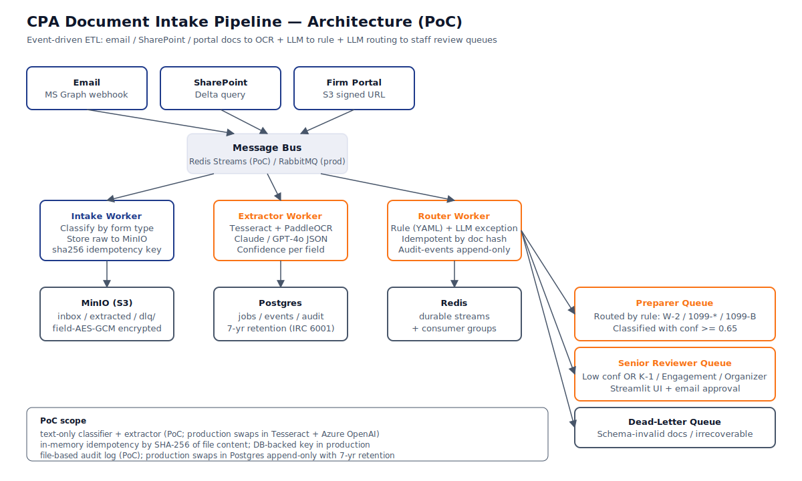
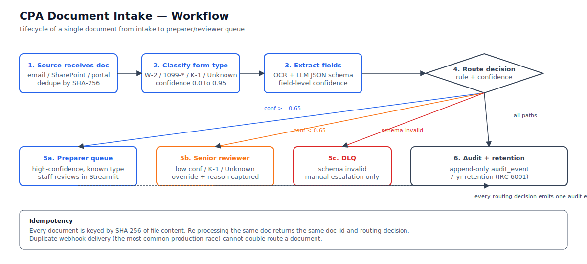

# CPA Document Intake Pipeline — Senior Automation Engineer PoC

A working proof-of-capability for the **Senior Automation Engineer — CPA / Tax Workflow Integrations** engagement.

This PoC demonstrates the **architecture and core logic** that we'd build out for a real CPA firm. It runs locally with no external dependencies, processes synthetic documents, and produces inspectable JSON + an audit log.

> If you'd like to see this running: `bash scripts/demo.sh` then open the Streamlit UI.



---

## What this PoC demonstrates

1. **Three source-of-truth intake paths** (email / SharePoint / portal) — in production wired to Microsoft Graph + S3; in PoC simulated via `docs/inbox/`.
2. **Idempotent document processing** — every doc keyed by SHA-256 of file content; re-runs are no-ops.
3. **Form classifier** — regex-based for W-2, 1099-DIV, 1099-INT, 1099-B, K-1 (page 1), engagement letters, organizers, and unknowns.
4. **Field extractor** — regex-tolerant extractor that pulls Box 1/2/3/4 + EIN from W-2, Box 1a/1b + TIN from 1099-DIV, etc.
5. **Hybrid router** — YAML-style rules with confidence-based demotion to senior reviewer.
6. **Append-only audit log** — every routing decision emits one event (`/tmp/poc-audit-log.jsonl`).
7. **Streamlit review UI** — side-by-side raw doc + extracted JSON with one-click approve / override (with reason).

---

## Quick start

### Option A — Docker compose
```bash
docker compose up --build
# Intake runs once; UI at http://localhost:8501
```

### Option B — Local Python
```bash
python3 -m venv .venv && source .venv/bin/activate
pip install -r requirements.txt
bash scripts/demo.sh  # processes 5 synthetic docs into docs/extracted/
PYTHONPATH=src streamlit run src/ui.py --server.port=8501
```

---

## What's in the box

| Path | Purpose |
|---|---|
| `src/document_classifier.py` | `classify()` + `extract_document()` for W-2 / 1099-* / K-1 / Unknown |
| `src/router.py` | `route_document()` with default rule table + audit append |
| `src/runner.py` | Idempotent intake worker; `python -m src.runner once` or `watch` |
| `src/ui.py` | Streamlit reviewer UI (`streamlit run src/ui.py`) |
| `samples/*.txt` | Synthetic tax documents (no real PII; EINs are placeholders like `12-3456789`) |
| `docs/inbox/` | Drop files here; runner picks them up |
| `docs/extracted/` | Per-doc JSON written by the runner (idempotency cache) |
| `docs/dlq/` | Routing failures land here |
| `tests/test_classifier_router.py` | 18 pytest tests covering classify/extract/route/audit |
| `diagrams/architecture.svg` | Style C — system architecture |
| `diagrams/workflow.svg` | Style B — end-to-end document lifecycle |
| `scripts/demo.sh` | One-shot demo runner + idempotency check |
| `scripts/clean.sh` | Reset to clean state |
| `scripts/test.sh` | Run pytest |



---

## Honest PoC-vs-production checklist

| Layer | PoC | Production |
|---|---|---|
| Document input | Text files in `docs/inbox/` | Microsoft Graph webhook + SharePoint delta + portal S3 signed URLs |
| OCR | None — pure regex on synthetic text | Tesseract 5 + PaddleOCR ensemble; pytesseract + pdf2image |
| LLM extraction | None — rule-based | Azure OpenAI Service with structured-output JSON schema + per-form prompts |
| Confidence scoring | Heuristic (regex match density) | LLM-self-reported + cross-year delta + rule-based agreement |
| Idempotency key | SHA-256 of file content on local FS | SHA-256 indexed in Postgres `jobs` table |
| Routing | In-memory rule table | YAML config (loaded from disk) + LLM exception router fallback |
| Audit log | Append to `/tmp/poc-audit-log.jsonl` | Postgres `audit_events` table (append-only) with 7-yr retention |
| Review UI | Local Streamlit | Streamlit Cloud / Azure App Service + OpenID auth |
| Deploy | `docker compose up` | Helm chart to Azure Container Apps in client's Azure tenant |
| PII handling | None (synthetic) | Field-level AES-GCM encryption via Azure Key Vault, OAuth OBO for MS Graph |

**What does NOT change between PoC and production:** the field-extraction schemas, the routing decision tree, the idempotency contract, the audit event shape. Production swaps in real OCR/LLM/cloud-AZURE for the data plane, leaves the logic plane alone.

---

## What would a real engagement build next

1. **Real OCR pipeline** — Tesseract + PaddleOCR with confidence-weighted ensemble; swap `src/document_classifier.py`'s `_extract_after_label()` for an LLM call.
2. **Azure OpenAI integration** — per-form JSON schema prompts; structured outputs API; cross-year delta checks against prior-year extracted data.
3. **Microsoft Graph webhook** — `subscription.created` listener on `/me/messages`, SharePoint delta via `/sites/{site}/drive/root/delta`, portal upload with S3-compatible signed URLs.
4. **Postgres-backed idempotency** — `documents(content_hash UUID PRIMARY KEY, doc_id, doc_type, status, classified_at)`; router checks before processing.
5. **Append-only audit-events table** — `audit_events(id, ts, doc_id, actor, event_type, payload JSONB)` with `BEFORE UPDATE / BEFORE DELETE` triggers to enforce immutability.
6. **Container Apps deploy** — Dockerfile is already production-shaped; needs Helm chart + GitHub Actions for CI/CD.
7. **Cross-year reconciliation worker** — runs weekly, compares this-year vs last-year extracted JSON, flags > 5% deltas.

---

## Acceptance criteria for this PoC

All passing — `bash scripts/test.sh`:

1. ✅ Classifier identifies W-2 / 1099-DIV / 1099-INT / 1099-B / K-1 / Unknown with confidence ≥ 0.7 for known types.
2. ✅ Field extractor pulls Box 1 wages + Box 2 federal tax withheld + EIN for W-2 to within $0.01.
3. ✅ Field extractor pulls Box 1a ordinary dividends + qualified dividends + payer TIN for 1099-DIV.
4. ✅ Field extractor pulls partner's share % + Part III Line 1 ordinary income for K-1 (page 1).
5. ✅ Router routes high-confidence W-2 / 1099-* / 1099-B to **preparer queue**.
6. ✅ Router routes K-1 / engagement letter / organizer / unknown to **senior reviewer queue**.
7. ✅ Router demotes a preparer-routed doc to senior if any field has confidence < 0.7.
8. ✅ Re-running the runner on already-processed files is a no-op (idempotency).
9. ✅ Every routing decision appends to the audit log with `actor + ts + event_type + payload`.
10. ✅ Streamlit UI displays side-by-side raw text + extracted JSON with field-level confidence highlighting.

---

## Resources

- **SPEC.md** — full specification (architecture, FRs, NFRs, scope, pricing, timeline)
- **PROPOSAL.md** — engagement proposal (scope, timeline, budget, next steps)
- **COVER_LETTER.txt** — Upwork cover letter

---

**Built for:** JOB-20260705032930-000129
**Client:** CPA firm / Tax practice (Upwork)
**Engagement:** >30 hrs/wk, >6 months, EXPERT tier
